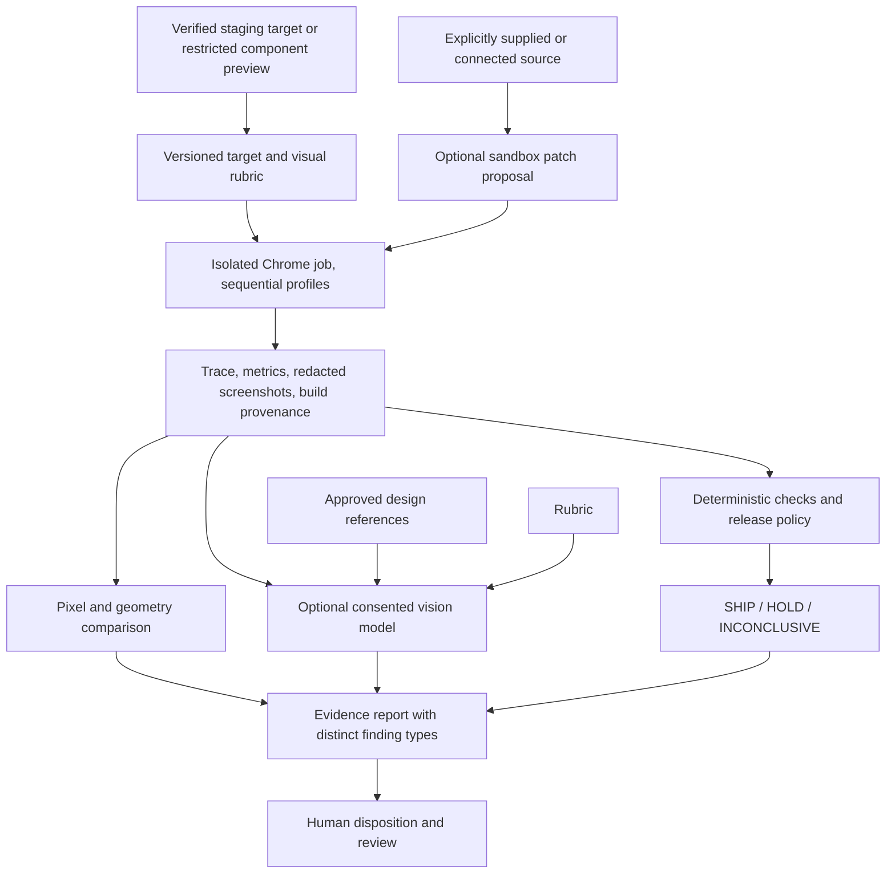

# Visual QA platform architecture

**Status: product architecture and implementation boundary.** This document
separates the small local screenshot-review experiment from future hosted,
component, design-reference, and code-correction workflows. A feature listed as
future is not shipped or measured.

## Product scopes

Atlas should offer two entry points that share evidence and policy concepts:

| Scope | Input | What Atlas can establish | What it cannot establish by itself |
| --- | --- | --- | --- |
| Experience release QA | Owned staging URL and versioned journey contract | Whether declared steps, fallback checks, performance budgets, and release invariants passed for the tested browser-emulation profiles | Customer conversion, untested flows, real-phone behavior, or what an uninstrumented page means to its business |
| Component visual QA | Authorized component preview URL, or a sandboxable source package | Rendered appearance at named viewports/profiles, pixel changes, explicit rubric findings, and component-level browser behavior | That a URL maps to supplied source, design intent without a reference/rubric, or correctness beyond tested evidence |

The first version should use an isolated component preview URL. Source upload and
repository integration follow only after a restricted renderer and package
inspection are available. A `.glb` is an asset input; Atlas's viewer does not
stand in for the customer's final component.

## User flow

1. A user creates an organization/project and selects **Experience release QA**
   or **Component visual QA**.
2. For a URL, the user verifies control of the staging hostname and lists
   allowed origins/redirects. For a source bundle, Atlas inspects the archive,
   reports accepted file types and resource limits, then renders it in a
   restricted preview. No public hosted renderer is enabled until egress and
   sandbox controls are enforced end to end.
3. The user defines named viewports/profiles, component states, interactions,
   success/fallback signals, criticality, and thresholds. A design reference
   can be attached with permission and matched to viewport/state. The rubric
   distinguishes measurable constraints (bounds, clipping, contrast threshold,
   text overflow, image diff) from subjective questions (hierarchy, coherence,
   intended visual language).
4. Atlas runs the deterministic browser harness first. It stores versioned
   configuration, browser/engine versions, test results, redacted screenshots,
   trace and network/console summaries. Unsupported or unobserved claims stay
   INCONCLUSIVE/UNTESTED.
5. Optional visual-model review receives only selected, consented screenshots,
   the user-written rubric, and reference images the user explicitly approved.
   The model returns structured suggestions with evidence coordinates and
   source-image hashes. Atlas validates and labels these suggestions; it never
   upgrades a deterministic failure or missing evidence to SHIP.
6. The report groups deterministic checks, pixel comparisons, model suggestions,
   user dispositions, and untested claims separately. Users can mark a finding
   valid, accepted, or false positive; these labels become evaluation data only
   under an explicit contribution policy.
7. When source is connected, an optional coding model may propose a patch in an
   ephemeral worktree. Atlas runs the same target contract against the original
   and candidate commit and shows the diff, tests, and regressions. A human
   reviews and opens the PR; Atlas never silently edits the default branch,
   merges, or deploys.

## Evidence and decision layers

The verdict is a function of versioned deterministic policy and test evidence.
Vision output can create an advisory finding or request review; it cannot create
a pass, suppress a hard invariant, or change a gate. Every result records source
(rule, pixel algorithm, or model), schema/model versions, input hashes, evidence
links, and whether execution completed. A provider timeout, malformed output,
low confidence, unsupported viewport, or absent screenshot is inconclusive.

Jev remains useful for typed classification and semantic triage through its
existing guarded interface. It is not a screenshot model and it does not write
code. A separately selected multimodal provider handles image interpretation;
a code model, if added, gets a separate scoped input and is gated by tests and
human review. Provider model identifiers and returned version strings must be
recorded. No provider is called by default.

## Visual rubric and finding schema

Each visual target should version:

- named component state and viewport/profile (dimensions, pixel ratio, browser
  build and emulation caveats);
- design-reference hash and its intended viewport/state, if present;
- measurable rules and tolerances, such as bounds, clipping, text overflow,
  contrast, alignment, responsive breakpoints, and deterministic image diff;
- subjective prompts written by the team, including what hierarchy or visual
  language they intend to preserve;
- finding severity policy, owner/disposition, and whether a finding is
  informational or release-critical.

Every issue includes a stable ID, category, objective/subjective label,
severity, uncalibrated model confidence when model-generated, concise
observation, recommendation, normalized screenshot region, screenshot hash,
profile/state, provider/model/prompt schema, and review disposition. Avoid a
single opaque “design score.” Report measurable components and evidence next to
each other. Do not call screenshot-only heuristics WCAG conformance; use a
separate DOM/accessibility inspection and identify its tested scope.

## Model evaluation before relying on suggestions

The first release is advisory only. Before any finding can block a release:

1. Build a consented, sanitized evaluation set spanning actual component types,
   viewport sizes, WebGL/WebXR fallbacks, themes, and known defect classes.
2. Have at least two reviewers label defects, acceptable variants, severity,
   false positives, and reference/rubric ambiguity; record disagreements.
3. Measure issue precision/recall by category and severity, localization
   overlap, repeatability across reruns, prompt-injection resistance, and
   behavior on blank/missing/low-quality screenshots. Publish sample sizes and
   confidence intervals.
4. Compare provider/model versions and prompts on a held-out set. Pin the
   requested model, record the returned model ID, and treat provider drift as a
   new evaluation.
5. Keep a human disposition step. Consider a blocking threshold only after a
   team has approved category-specific error costs and evidence supports the
   threshold. Do not convert a global confidence label into a release score.

No such visual benchmark currently exists in this repository. Synthetic Jev
fixtures are not suitable visual-model data.

## Current implementation and remaining work

The local `atlas visual-review` experiment accepts final screenshots already
present in a versioned owned-staging matrix report or one user-provided
component PNG under `artifacts/`. Component mode may include one same-size
`--reference` PNG and explicit `--criteria`; both images and criteria are sent
in the same provider request, and issue regions are in current screenshot
coordinates. Matrix capture consent is checked on the target contract; the
component path records that Atlas did not capture the images. In both cases
`--consent-to-send-images` is a separate per-run egress decision and
`GROQ_API_KEY` is read from the environment. The review is capped at three
matrix screenshots or two component images, validates size/dimensions and PNG
structure, calls a configured Groq vision model, validates a bounded JSON
issue schema, and writes `artifacts/visual-review/review.json`. The HTML report
shows findings as advisory and displays reference/current images separately.
Tests use a mocked fetch. One live smoke request used synthetic images and
returned inconclusive because the model omitted a requested image region. The
adapter now accepts an omitted region as null, but there is no successful
post-fix live measurement and no quality, latency, or cost evaluation.
The default visual model is an implementation default, not a durability promise;
Groq currently lists Qwen 3.8 among preview models, so verify lifecycle and
availability before any hosted or paid use ([Groq model catalog](https://console.groq.com/docs/models)).

`atlas suggest-code-fix --source <file> --consent-to-send-code` is a separate
opt-in text-model proposal pass. It accepts one UTF-8 source file under
`artifacts/` (up to 64 KiB), blocks several common credential patterns, reads
analyzed findings from the local visual-review JSON, and writes a
single-file unified-diff proposal. The report labels it unapplied and untested.
The adapter validates the single-file path, hunk structure and line counts, then
matches every context/deleted line against the supplied source in memory. It
records source and proposed-candidate hashes but does not persist the candidate
source. The diff is not written into a repository, executed, checked with the
customer's test suite, or sent to a PR. Tests mock the provider; no source was
sent to Groq and the quality of its changes has not been evaluated.

`atlas visual-compare --baseline <png> --actual <png>` computes an exact
pixel-difference ratio and a coarse 16-by-16 luminance similarity, then writes
a JSON result and red difference heatmap. This is deterministic pairwise
evidence with configurable thresholds. It is not a design review; mismatched
image dimensions are inconclusive, and passing means only that this image pair
fits those thresholds.

The control-plane UI now includes a consented PNG component review and report
history. An owned-staging target may also declare up to five component CSS
selectors; when screenshot capture consent is enabled, Chromium captures each
unique visible in-viewport element as a separate crop at the final declared
journey checkpoint. Configured redaction selectors are applied before both the
full checkpoint and crops. Missing, duplicate, hidden, oversized, or off-screen
matches are reported as capture gaps and do not become a visual pass. Inspect
the images before sharing or selecting one for separate Groq egress consent.
The crop feature extends the optional `screenshots.componentSelectors` field
within target contract schema v1; contracts that omit it remain valid.

Images are size/dimension checked, processed in memory, sent to Groq only after
explicit consent, and not persisted; the JSON findings, image hashes, and
criteria are retained in Postgres for 30 days with an audit event. A hard limit
of ten requests per organization per UTC day is enforced in Postgres. This is
synchronous local control-plane execution, not an isolated worker. The crop is
not an arbitrary component-state recorder: it captures only the declared final
journey state under Chromium emulation.

A completed review with findings can also start a separate-consent code
proposal. The route sends one source file (up to 64 KiB), validated findings,
and an optional task to Groq. Common credential patterns are blocked, but this
does not guarantee secret detection. Source text is not retained; the filename,
hash, result, and unapplied diff are retained for 30 days and purged with an
audit event. Diffs may reproduce source lines. The default local abuse ceiling
is five proposals per organization per UTC day. Proposals are never applied,
executed, tested, or allowed to change SHIP/HOLD. This synchronous flow has a
process-local idempotency lock and is not ready for public hosting.

The system still lacks hosted browser execution, private object storage,
component URL preview, a persistent reference library, DOM-level visual checks,
a versioned rubric editor, reviewer dispositions, a managed secret vault,
distributed egress/rate controls, isolated patch evaluation, PR integration,
and a visual model evaluation corpus. It is not a production service.

## Build order

1. Finish the local visual review artifact and accessible report presentation;
   verify with synthetic screenshots and inspect desktop/mobile render.
2. Add versioned visual target/rubric contracts and a component preview lane
   behind local-only execution; add deterministic viewport, geometry, and
   redacted screenshot comparisons before model critique.
3. Move consented visual review from the current synchronous local API to a
   queued hosted task only after tenant-isolated artifact access, managed secret
   storage, distributed quotas, audit, retention deletion, and worker network
   isolation are enforced.
4. Collect an explicitly consented evaluation set and measure model quality
   before describing findings as reliable or allowing policies to reference
   them.
5. Extend the current unapplied local patch suggestion into a sandbox that
   validates patch paths, installs no untrusted dependencies by default, runs
   the same target contract against original/candidate commits, and shows test
   output and regressions. Add repository/PR permissions only after security
   review and human approval.
6. Add GitHub release checks after target runs produce reliable immutable
   reports; real devices remain a distinct later lane.

Commercial positioning, live billing, and external launch remain decisions for
the owner after customer discovery and security review. This plan makes no
claim about demand, pricing, reliability, certification, or fundraising outcome.
